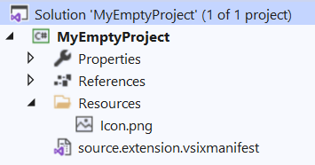
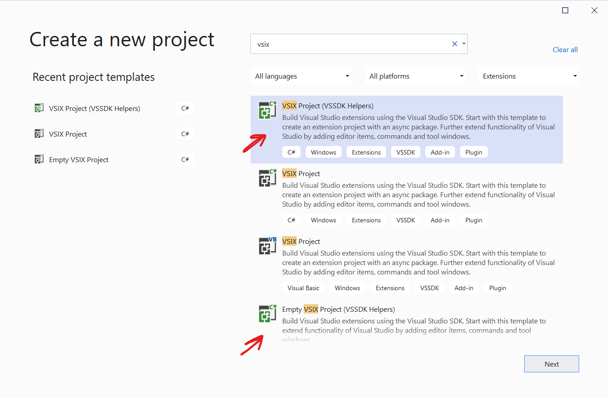
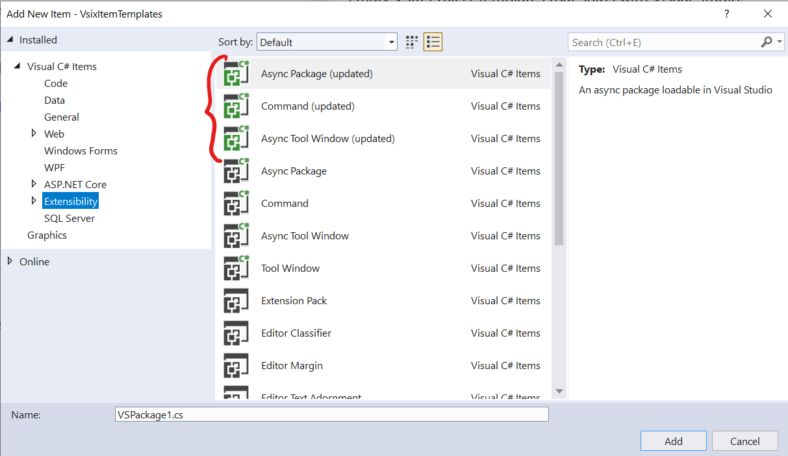
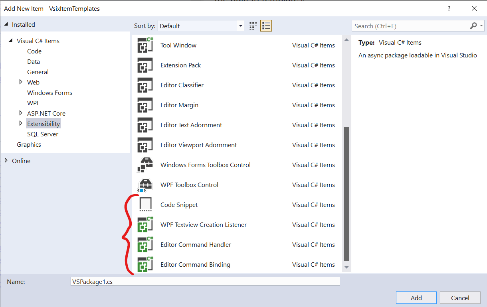

# Extensibility Templates

Awesome item templates for VSIX development

Download this extension from the [Marketplace](https://marketplace.visualstudio.com/items?itemName=MadsKristensen.ExtensibilityItemTemplates)
or get the [CI build](https://www.vsixgallery.com/extension/88049e1e-62f2-4ea2-851f-9ddb2de37f41).

----------------------------------------------

A template pack for Visual Studio extension authors.

## Project templates
Two new project templates replaces the existing *VSIX Project* and *Empty VSIX Project* templates that ships with Visual Studio.

The two project templates are:

### 1. VSIX Project (updated)
This template generates a clean VSIX project with a *AsyncPackage* class, an extension icon, and NuGet references to the VSSDK.

### 2. Empty VSIX Project (updated)
This template generates an empty VSIX project with only an extension icon and NuGet references to the VSSDK.

Find both templates in the New Project Dialog.

They are both cleaned up and simplified versions of the built in templates.

## Item templates
The first three item templates are cleanup and simplified versions of the built in templates.

* [Async Package (updated)](https://github.com/madskristensen/VsixItemTemplates/blob/master/src/ItemTemplates/Package/VsPkg.cs)
* [Command (updated)](https://github.com/madskristensen/VsixItemTemplates/blob/master/src/ItemTemplates/CustomCommand/Command.cs)
* [Async Tool Window (updated)](https://github.com/madskristensen/VsixItemTemplates/tree/master/src/ItemTemplates/ToolWindow)

In addition, there are seveal other templates available.

* [Editor Command Binding](https://github.com/madskristensen/VsixItemTemplates/blob/master/src/ItemTemplates/EditorCommandBinding/EditorCommandBinding.cs)
* [Editor Command Handler](https://github.com/madskristensen/VsixItemTemplates/blob/master/src/ItemTemplates/EditorCommandHandler/EditorCommandHandler.cs)
* [WPF TextView Creation Listener](https://github.com/madskristensen/VsixItemTemplates/blob/master/src/ItemTemplates/TextviewCreationListener/TextviewCreationListener.cs)
* [Code Snippets](https://github.com/madskristensen/VsixItemTemplates/blob/master/src/ItemTemplates/Snippet/Snippet.snippet)

## License
[Apache 2.0](LICENSE)