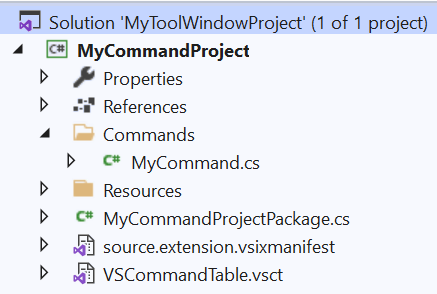
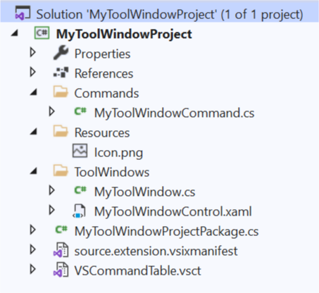

# Extensibility Template Pack

A template pack for Visual Studio extension authors that provide useful project and item templates.

Download this extension from the [Marketplace](https://marketplace.visualstudio.com/items?itemName=MadsKristensen.ExtensibilityItemTemplates)
or get the [CI build](https://www.vsixgallery.com/extension/88049e1e-62f2-4ea2-851f-9ddb2de37f41).

----------------------------------------------

## Project Templates
The project templates are simplified versions of the existing *VSIX Project* and *Empty VSIX Project* templates that ship with Visual Studio. They also include a reference to the [Community.VisualStudio.Toolkit](https://www.nuget.org/packages/Community.VisualStudio.Toolkit/) NuGet package, which makes extension development a lot easier.

All templates can be found in the New Project Dialog.

### VSIX Project (Community)
This template generates a VSIX project with an *AsyncPackage* class, an extension icon, and NuGet references to the VSSDK.

### VSIX Project w/Command (Community)
Same as the VSIX Project (Community) template, but also includes a custom command.

### VSIX Project w/Tool Window (Community)
Same as the VSIX Project (Community) template, but also includes a custom command and tool window.

### Empty VSIX Project (Community)
This template generates an empty VSIX project with only an extension icon and NuGet references to the VSSDK.

----------------------------------------------

## Item Templates

All templates can be found in the Add New Item Dialog.

The templates marked `(Modern)` can be used with the regular Visual Studio SDK. They are a modern version of the original templates, but follow best practices and are much simpler.

The templates marked `(Community)` can be used with the [Community.VisualStudio.Toolkit](https://www.nuget.org/packages/Community.VisualStudio.Toolkit/) NuGet package.

* [Async Package (modern)](https://github.com/madskristensen/VsixItemTemplates/blob/master/src/ItemTemplates/Package/VsPkg.cs) TODO: Fix link.
* [Command (modern)](https://github.com/madskristensen/VsixItemTemplates/blob/master/src/ItemTemplates/CustomCommand/Command.cs) TODO: Fix link.
* [Command (Community)](https://github.com/VsixCommunity/ExtensibilityTemplatePack/tree/master/src/2022/ItemTemplates/CustomCommandCommunity)
* [Async Tool Window (modern)](https://github.com/madskristensen/VsixItemTemplates/tree/master/src/ItemTemplates/ToolWindow) TODO: Fix link.
* [Async Tool Window (Community)](https://github.com/VsixCommunity/ExtensibilityTemplatePack/tree/master/src/2022/ItemTemplates/ToolWindowCommunity)
* [Options Page (Community)](https://github.com/VsixCommunity/ExtensibilityTemplatePack/tree/master/src/2022/ItemTemplates/OptionsPageCommunity)

In addition, there are several other templates available.

* [Editor Command Binding](https://github.com/VsixCommunity/ExtensibilityTemplatePack/tree/master/src/2022/ItemTemplates/EditorCommandBinding)
* [Editor Command Handler](https://github.com/VsixCommunity/ExtensibilityTemplatePack/tree/master/src/2022/ItemTemplates/EditorCommandHandler)
* [WPF TextView Creation Listener](https://github.com/VsixCommunity/ExtensibilityTemplatePack/tree/master/src/2022/ItemTemplates/TextviewCreationListener)
* [Code Snippets](https://github.com/VsixCommunity/ExtensibilityTemplatePack/blob/master/src/2022/ItemTemplates/Snippet/Snippet.snippet)

## License
[Apache 2.0](LICENSE)
